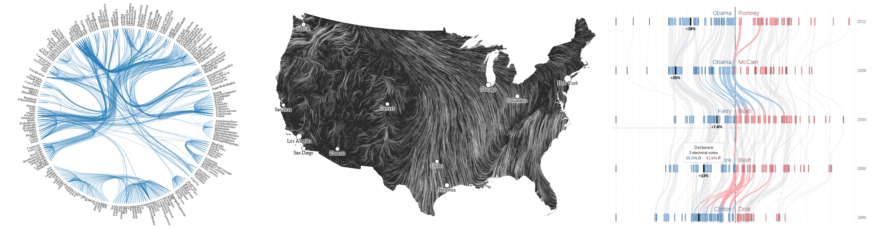

#  &nbsp; &nbsp; &nbsp;       <u class="cs">CS</u> <u class="rest">1</u><u class="number">7</u><u class="rest">1 - *Visualization*</u> 

[gimmick:theme](readable)

**Instructor: Hanspeter Pfister **

The amount and complexity of information produced in science, engineering, business, and everyday human activity is increasing at staggering rates. The goal of this course is to expose you to visual representation methods and techniques that increase the understanding of complex data. Good visualizations not only present a visual interpretation of data, but do so by improving comprehension, communication, and decision making.

In this course you will learn how the human visual system processes and perceives images, good design practices for visualization, tools for visualization of data from a variety of fields, collecting data from web sites with Python, and programming of interactive web-based visualizations using D3.

### Logistics

**Lectures & Design Studios:** Tu, Th 2:30-4 pm
Maxwell Dworkin G115

**Labs:** F 10-11:30 am
Maxwell Dworkin G115 

### Lecture Reseources
[Adobe Connect Live Classroom](http://continuinged.adobeconnect.com/cs171/)
Live Video (alternate)
2014 Video Archive
[2013 Video Archive](http://cm.dce.harvard.edu/2013/02/22872/publicationListing.shtml)
[2012 Video Archive](http://cm.dce.harvard.edu/2012/02/22872/publicationListing.shtml)
Lecture Slides

### Preview

