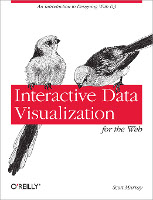

#  &nbsp; &nbsp; CS 171 - Readings

Readings are from the two required books and additional papers that will be provided. 

**This information is still subject to (slight) changes**

[DFI - Design for Information](http://www.amazon.com/Design-Information-Isabel-Meirelles/dp/1592538061), Isabel Meirelles, Rockport (2013)

[D3 - Interactive Data Visualization for the Web](http://www.amazon.com/Interactive-Data-Visualization-Scott-Murray-ebook/dp/B00BSG68UQ), Scott Murray, O'Reilly (2013)
*[Free online version](http://chimera.labs.oreilly.com/books/1230000000345), [Free Safari book version for Harvard Students](http://my.safaribooksonline.com/book/web-design-and-development/9781449340223)*

### Week 1
D3: Chapters 1-4
Git Tutorial - [Understanding Git Conceptually](http://www.sbf5.com/~cduan/technical/git/)

### Week 2
D3: Chapters 5-8
DFI: Chapter 1

### Week 3
D3: Chapters 9-11
DFI: Chapter 2

### Week 4
D3: Chapters 12
DFI: Chapter 3

### Week 5
DFI: Chapter 4

### Week 6
DFI: Chapter 5

### Week 7
DFI: Chapter 6
