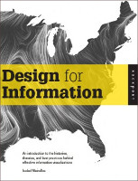

#  &nbsp; &nbsp; &nbsp;       <u class=cs>CS</u> <u class=rest>1</u><u class=number>7</u><u class=rest>1 - Readings</u>

Readings are given out of these two text-books, in addition to other readings that are provided:

[Design for Information (DFI)](http://www.amazon.com/Design-Information-Isabel-Meirelles/dp/1592538061), Isabel Meirelles, Rockport (2013)

[Interactive Data Visualization for the Web (D3)](http://www.amazon.com/Interactive-Data-Visualization-Scott-Murray-ebook/dp/B00BSG68UQ), Scott Murray, O'Reilly (2013)

The (tentative) reading list:

### Week 1
D3: Chapter 1-3

### Week 2
D3: Chapter 4-6
DFI: Chapter 1

### Week 3
D3: Chapter 7-8
DFI: Chapter 2

### Week 4
D3: Chapter 9-11
DFI: Chapter 3

### Week 5
D3: Chapter 12
DFI: Chapter 4

### Week 6
DFI: Chapter 5

### Week 7
DFI: Chapter 6
