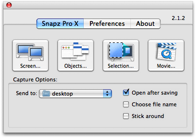
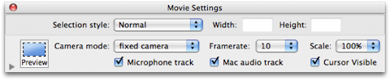
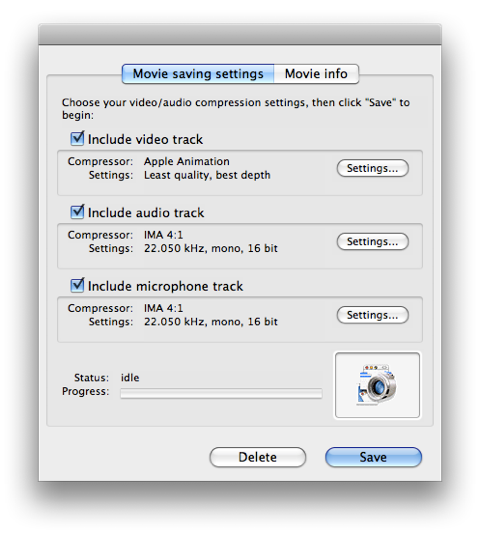
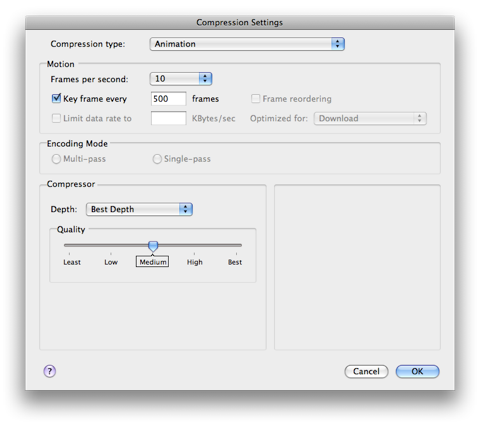

#  &nbsp; &nbsp; CS 171 - How To Make A Screencast

For your Projects you will create a two-minute screencast video of your project demo and/or some slides. We will show some of these videos in class and you will put them online. The video must also include narration. Below, you will find information on downloading and installing free screencast software. Note that we will stop showing the video after two minutes, so please make sure you are not running longer than that. 

There are various screencast software packages available. Below we describe one for Mac OsX and one for Windows, but you are welcome to use whatever you like. 

## For Mac Users
If you are running MacOS X 10.6 Snow Leopard, you can use the new screencast feature of Quick Time X. More information is available [here](http://www.makeuseof.com/tag/quick-screencasting-using-quicktime-x-in-mac-snow-leopard/). 

Otherwise you can get a free trial version of the Ambrosia software [SnapzProX](http://www.ambrosiasw.com/utilities/snapzprox/) that will last for 15 days or 100-uses, which ever comes first. SnapzProX is relatively easy to use, but the trial version does not contain video editing software. Thus, once you record and compress your two-minute demo you can't make any changes unless you use some other sort of video editing software.

Download the SnapzProX software, and install SnapzProX in your Applications directory.

Once you run SnapzProX the first time, it will always be running in the background on your machine, but no icon will appear in your icon tray. To start SnapzProX, press command+shift+3. A window like the image below will pop up.

Click the Movie button. Your desktop will dim, and a dashed-line rectangle will appear, along with the following window:

In the window, select the microphone track if you will be recording audio narration of your demo, and also select Mac audio track if your demo includes sound. Also, make sure that the Camera mode is set to fixed camera so that the capture area remains fixed during recording. Drag the rectangle around and position over the part of your screen you want to capture. You can also adjust the size of the area. If your video ends up being too big (larger then 100MB), try selecting the scale to be 50% or 75%.
When you are ready to start recording, press the enter key.
Run your demo.
When you are finished, press command+shift+3 again to stop recording. The following window will pop up:

Make sure to check the audio and microphone tracks if you need them, or deselect if you don't. You will need to experiment with the Video track settings to ensure that your video file is under 100MB (which is the max size for uploading). If you click on Settings under the Video track, you will get a window like this:

Try different compression levels to see how compressed you can make your video without sacrificing the content.

### For Windows Users
You can get a free trial version of the Techsmith software [Camtasia](http://www.techsmith.com/camtasia.asp) that will last for 30 days. Camtasia is an easy to use recording and editing suite, so you can also splice and dice your screen captures into a final movie.

Download and install the Camtasia software.

The best way to learn about Camtasia is to actually watch a couple of their how-to videos on recording and editing. We suggest watching (under "How to..." Videos): Record Video; Edit with Camtasia Studio; and Produce Video. After watching these three videos you will be able to record, edit, and export (or, produce) you demo video. Please produce you videos in the Quicktime .mov format. You may need to experiment with the compression options for Quicktime when you produce you video to make sure the final video is under 100MB.