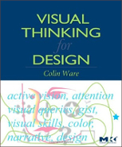
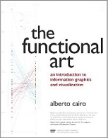

#  &nbsp; &nbsp; CS 171 - Syllabus

Welcome to CS171! This course is an introduction to key design principles and techniques for interactively visualizing data. The major goals of this course are to understand how visual representations can help in the analysis and understanding of complex data, how to design effective visualizations, and how to create your own interactive visualizations using modern web-based frameworks. 

This course, when taken for a letter grade, meets the Harvard General Education requirement for Empirical and Mathematical Reasoning. The course is also offered through the Harvard University Extension School as distance education course CSCI E-171. All lectures and labs are recorded and archived in addition to being streamed live during meeting times. 

**After successful completion of this course, you will be able to...**

 * Critically evaluate visualizations and suggest improvements and refinements
 * Use JavaScript and other tools to scrape, clean, and process data
 * Use standalone visualization applications to quickly explore data
 * Apply a structured design process to create effective visualizations
 * Conceptualize ideas and interaction techniques using sketching 
 * Use principles of human perception and cognition in visualization design
 * Create web-based interactive visualizations using JavaScript and D3
 * Use storytelling principles to design coherent and clear visualizations
 
Students without the technical background recommended for CS171 might want to consider [EMR19](http://artofnumbers.org/), a course focusing more on the applications and history of visualization and requiring little or no programming.

## Course Logistics

### Prerequisites

Students are expected to have programming experience (e.g., CS50). Exceptions by permission of the instructor.

### Required Textbooks

We will be using two textbooks for this class, one to cover conceptual aspects of visualization, one to teach the necessary technical skills. 

[Design for Information](http://www.amazon.com/Design-Information-Isabel-Meirelles/dp/1592538061), Isabel Meirelles, Rockport (2013)

*“The visualization process doesn’t happen in a vacuum; it is grounded in principles and methodologies of design, cognition, perception, and human-computer-interaction that are combined to one’s personal knowledge and creative experiences. Design for Information critically examines other design solutions —current and historic— helping you gain a larger understanding of how to solve specific problems. This book is designed to help you foster the development of a repertoire of existing methods and concepts to help you overcome design problems.”*

[Interactive Data Visualization for the Web](http://www.amazon.com/Interactive-Data-Visualization-Scott-Murray-ebook/dp/B00BSG68UQ), Scott Murray, O'Reilly (2013)  
*[Free online version](http://chimera.labs.oreilly.com/books/1230000000345), [Free Safari book version for Harvard Students](http://my.safaribooksonline.com/book/web-design-and-development/9781449340223)*

*An introduction to D3 for people new to programming and web development, published by O’Reilly. “Explaining tricky technical topics with aplomb (and a little cheeky humor) is Scott Murray’s forte. If you want to dive into the world of dynamic visualization using web standards, even if you are new to programming, this book is the place to start.” - Mike Bostock, creator of D3*

### Recommended Textbooks

These recommended textbooks will allow you to deepen your understanding of specific aspects of the course, such as perception and storytelling.

[Visual Thinking for Design](http://www.amazon.com/Visual-Thinking-Kaufmann-Interactive-Technologies/dp/0123708966),  Colin Ware, Morgan Kaufman (2008)

*“All the clanking gears are here: variable resolution image detection, eye movements, environmental information statistics, bottom-up/top-down control structures, working memory, the nexus of meaning, and specialized brain areas and pathways. By the time he’s done, Ware has reconstructed cognitive psychology, perception, information visualization, and design into an integrated modern form. This book is scary good.” - Stuart Card, Senior Research Fellow, and manager of the User Interface Research group at the Palo Alto Research Center*

[The Functional Art: An introduction to information graphics and visualization](http://www.amazon.com/The-Functional-Art-introduction-visualization/dp/0321834739/), Alberto Cairo, New Riders (2012)

*“If graphic designer Nigel Holmes and data visualizer Edward Tufte had a child, his name would be Alberto Cairo. In The Functional Art, accomplished graphics journalist Cairo injects the chaotic world of infographics with a mature, thoughtful, and scientifically grounded perspective that it sorely needs. With extraordinary grace and clarity, Cairo seamlessly unites infographic form and function in a design philosophy that should endure for generations.” - Stephen Few, author of Show Me the Numbers*

### Online Discussion Forum
We use Piazza as our online forum. Piazza is your main venue to ask questions, discuss problems, and help each other out. Piazza is a question-and-answer system designed to streamline class discussion outside of the classroom. It should always be your first recourse for seeking answers to your questions about the course, lecture or reading material, or the assignments. Piazza supports LaTeX, code formatting, embedding of images, and attaching of files. We will also use Piazza for all announcements, so it is important that you are signed up. 

### Online Videos
All lectures and labs will be broadcast live via Adobe Connect, including live video from the classroom, a synchronized view of the projected slides, and a chat window to ask questions and to contact fellow online students. In case the Adobe Connect server fails, you can also connect to an alternate live video feed. Both features will only work during class time. The archived videos of the lectures and labs are available about 24 hours after meeting time from the course homepage. 

### Office Hours
The staff will hold weekly office hours, either in person or online for distance education students. Office hour times and locations will be listed on Piazza. Office hours provide you with an opportunity to review and discuss course materials as well as provide further guidance for your homework in a more intimate environment, with only your teaching fellow and maybe a handful of classmates present. Online students can make special arrangements directly with teaching fellows to meet online.

## Course Components

### Lectures
The class meets twice a week for lectures and joint class activities. The class activities are designed to help you master the relevant materials, to work on your homework in groups, and to get you started on your project. The weekly schedule of lectures is posted on the course web site. 

### Labs
Lectures are supplemented by weekly 60- to 90-minute labs led by the teaching fellows or guest lecturers. Labs are an important aspect of the course, as we will supplement material from lectures with examples, discuss programming environments (e.g., JavaScript and D3), and teach you important skills (e.g., sketching with pen and paper). Lab topics are announced in the schedule. Labs will also give you the opportunity to work on your homework and your projects while TFs are present to answer your questions.

### Design Studios
Held during lecture times, design studios are where you will hone your skills in designing visualizations using sketching and rapid, paper-based prototyping. At the beginning of each design studio we will form groups of 4-5 students and you will be given a visualization problem. You then work on multiple solutions by yourself. After 30 minutes, you will discuss and evaluate your respective designs in the group. At the end of the design studio you hand in your best solutions and a critique of them as a group. Online-only participants are encouraged to work in online-teams but are allowed to work individually. Online only students have to turn in the design studio exercise within 24 hours after its publication.

### Project
At the core of the course is your project. The goal of the project is to design a web site and interactive visualizations that answer questions you have about some topic of your own choosing. You will acquire the data, design your visualizations, implement them, and critically evaluate the results. The path to a good visualization is going to involve mistakes and wrong turns. It is therefore important to recognize that mistakes are valuable in finding the path to a solution, to broadly explore the design space, and to iterate designs to improve possible solutions. The project has an intermediate milestone that will allow you to get feedback and to iterate. 

In your project you will work closely with classmates in 2-3 person project teams. You can come up with your own teams and use Piazza to find prospective team members. If you cannot find a partner we will team you up randomly. We recognize that individual schedules, different time zones, preferences, and other constraints might limit your ability to work in a team. If this the case, ask us for permission to work alone. 

### Homework
There is no question that the best way to learn how to create effective visualizations is by creating them. Bi-weekly homework assignments are going to provide an opportunity to learn design and programming skills and to test your understanding of the material. The homeworks are designed to support you in developing your projects. See the homework as an opportunity to learn, and not to “earn points”. The homework will be graded holistically to reflect this objective.

### Reading Assignments
The course schedule includes required weekly readings – you are free to study ahead, but the schedule ensures that you are prepared for the activities in class and the homework. The goal of the reading assignments is to familiarize yourself with new terminology and definitions, to learn new design and programming skills, and to determine which part of the subject needs more attention. The homework assignments will contain questions about the mandatory readings. When answering those please be brief and to the point!

## Course Policies

### Assessment Procedure
Your final grade in CS171 will be determined by the number of points you collect. You can collect various amounts of points for the different parts of the class:

 * Project: 50%, assessed on meeting the project criteria and your peer assessment. 
 * Homework: 40%, assessed on your individual submission. 
 * Design Studios: 10% assessed on the quality of your design studio solutions and reflections.

Teaching Fellows will evaluate your work holistically beyond mechanical correctness and focus on the overall quality of the work using the following scale (in 0.5 increments):

4 = Excellent / no mistakes (or really minor)
3 = Good / some mistakes
2 = Fair / some major conceptual errors
1 = Poor / did not finish
0 = Did not participate / did not hand in

A weighted overall average of 4 constitutes a perfect grade and is equivalent to an A. A combination of 4s and 3s end up being A- to B, and so on. An average of better than 2 is required to pass the course. In addition to the scores the Teaching Fellows will give detailed written feedback.

In addition, the staff will select the top projects through a review and voting process. These projects will be presented during our last lecture, featured on the website, and get up to 5 points for their exceptional work. A small numer of projects will win the coveted Best Project prize including Swiss chocolate. 

### Project Group Peer Assessment
In the professional world, three important features affect your productivity and success: your own effort, the effort of people you depend on, and the way you work together. For this reason we have chosen a team-based approach that values all three of those features. After each team-based project you will provide an assessment of the contributions of the members of your team, including yourself. Your scores on the projects are adjusted up or down depending on the following factors:

 * Your teammates’ view of your contributions to the team
 * The accuracy of your own assessment of your contributions
 * The accuracy of your assessment of each of your teammates’ contributions

Your teammates’ assessment of your contributions and the accuracy of your self-assessment will be considered as part of your overall course evaluation.

### Collaboration Policy
You are welcome to discuss the course's ideas, material, and homework with others in order to better understand it, but **the work you turn in must be your own** (or for the project, yours and your teammate’s). For example, you must write your own code, design your own visualizations, and critically evaluate the results in your own words. You may not submit the same or similar work to this course that you have submitted or will submit to another. Nor may you provide or make available solutions to homeworks to individuals who take or may take this course in the future. 

### Quoting Sources 
You must acknowledge any source code that was not written by you by mentioning the original author(s) directly in your source code (comment or header). You can also acknowledge sources in a README.txt file if you used whole classes or libraries. Do not remove any original copyright notices and headers. However, you are encouraged to use libraries, unless explicitly stated otherwise! 

You may use examples you find on the web as a starting point, provided its license allows you to re-use it. You must quote the source using  proper citations (author, year, title, time accessed, URL) both in the source code and in any publicly visible material. You may not use existing complex combinations or large examples. For example, you may not use a ready to use multiple linked view visualization. You may use parts out of such examples. 

### Questionnaires
During the course of the semester, you will complete a number of questionnaires online. The purpose of these questionnaires is to evaluate how well this course works for you. Your answers will only be used to provide feedback on your learning and make adjustments to the course. They will not affect your grade in any way. 

### Missed Activities and Assignment Deadlines 
Projects and homework must be turned in on time, with the exception of late days for homework as stated below. Because of the emphasis on teamwork, it is important that everybody attends and proactively participates in class and online. Due to the collaborative nature of the activities, it is not possible to make up any missed team activities, such as project work or design studios. (The same, incidentally, is true in the professional world.) We understand, however, that certain factors may occasionally interfere with your ability to participate or to hand in work on time. If that factor is an extenuating circumstance, we will ask you to provide documentation directly issued by the University, and we will try to work out an agreeable solution with you (and your team). 

### Homework Late Days
In the weeks when homeworks are due, they will be due on Thursdays at 11:59 pm, unless otherwise announced. Each student is given **six late days** for homework at the beginning of the semester. A late day extends the individual homework deadline by 24 hours without penalty. **No more than two late days may be used on any one assignment. Assignments handed in more than 48 hours after the original deadline will not be graded.** If you have already used all of your late days for the semester, we will deduct 1 point for assignments <24 hours late, and 2 points for assignments 24-48 hours late. **We do not accept any homeworks under any circumstances more than 48 hours after the original deadline.** Late days are intended to give you flexibility: you can use them for any reason – no questions asked. You don't get any bonus points for not using your late days. Also, you can only use late days for homework deadlines – **all other deadlines (e.g., project milestones) are hard.**

### Regrading Policy
It is very important to us that all assignments are properly graded. If you believe there is an error in your assignment grading, please submit an explanation via email to us (the staff mailing list) **within 7 days** of receiving the grade. No regrade requests will be accepted orally, and no regrade requests will be accepted more than 7 days after you receive the grade for the assignment.   

### Guest Lecture Attendance
We are lucky to have some of the world’s best visualization researchers take time out of their busy schedules to give guest lectures. We expect all non-distance students to attend these lectures and engage the speakers with questions and comments. You must send an email to the staff at least a day before a guest lecture to be excused.

## Additional Information

### Accessibility
If you have a documented disability (physical or cognitive) that may impair your ability to complete assignments or otherwise participate in the course and satisfy course criteria, please meet with us at your earliest convenience to identify, discuss, and document any feasible instructional modifications or accommodations. You should also contact the Accessible Education Office to request an official letter outlining authorized accommodations.

### Credits
Some of the material in this course is based on the classes taught by Miriah Meyer at the University of Utah, Tamara Munzner at the University of British Columbia, Canada, Pat Hanrahan at Stanford, Jeff Heer at the University of Washington, and Maneesh Agrawala and UC Berkeley. We have heavily drawn on materials and examples found online and tried our best to give credit by linking to the original source. Please contact us if you find materials where the credit is missing or that you would rather have removed. 

### User Notice for Copyrighted Materials on Course Websites
This course website, and much of the text, images, graphics, audio and video clips, and other content of the site (collectively, the “Content”), are protected by copyright law. In some cases, the copyright is owned by third parties, and Harvard is making the third-party Content available to you under the fair use doctrine. Fair use permits only certain limited uses of the Content.
You may use the website and its Content only for your personal, noncommercial educational and scholarly use. Some Content may be provided via streaming or other means that restrict copying; you may not circumvent those restrictions. If you wish to distribute or make any of the Content available to others, or to use any Content commercially, or to use any Content for any purpose other than your personal, noncommercial educational and scholarly use, you must obtain any required permission from the copyright holder. User notice courtesy of the Harvard University Office of General Counsel.
